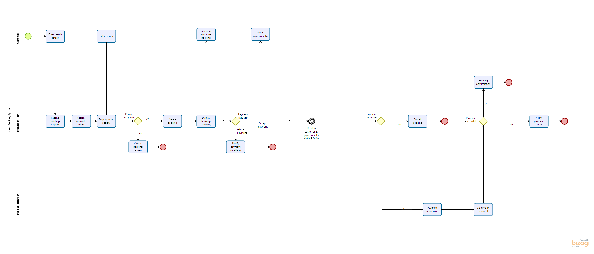
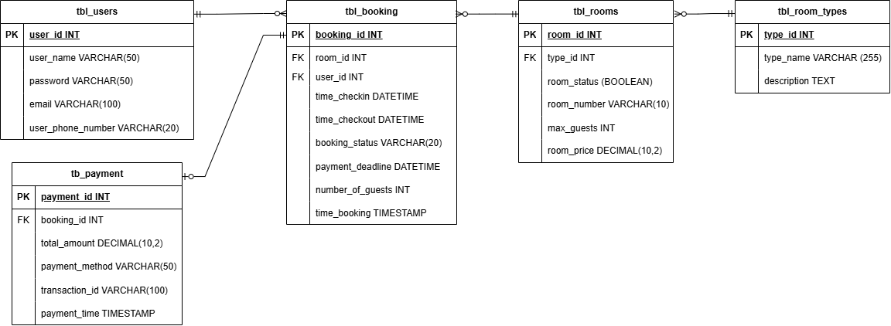
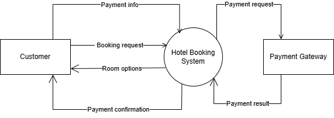
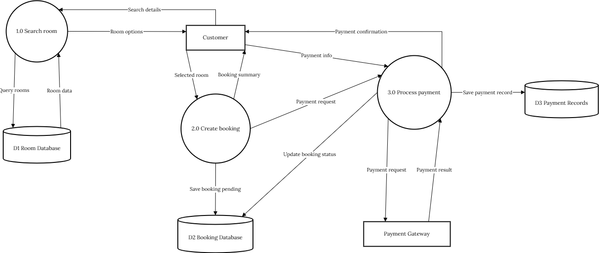
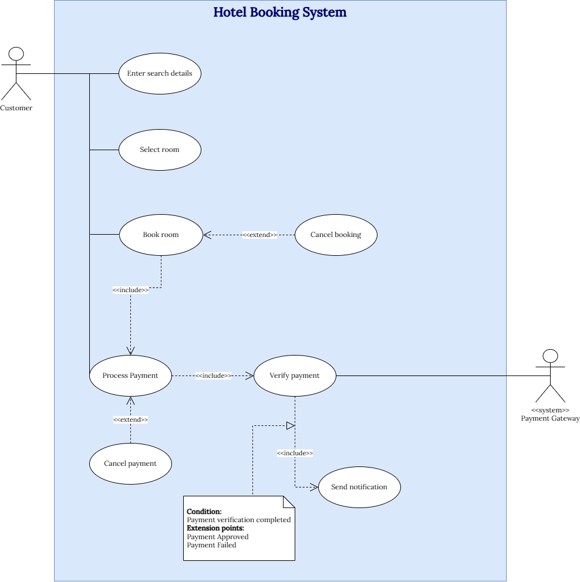

# Hotel Booking System – Business Analysis Project

## 1. System Overview
The Hotel Booking System is an online platform that allows customers to search for available rooms, make bookings, and complete payments through an integrated payment gateway. The system aims to streamline the booking process and enhance user experience.

---

## 2. Problem Statement
Current hotel booking processes are often manual, leading to delays, errors, and inefficient customer experience. There is a need for an automated system to improve booking efficiency and ensure reliable transaction handling.

---

## 3. Objective
- Automate the hotel booking process;
- Improve customer experience;
- Ensure secure and reliable payment handling.

---

## 4. Scope
- Search Room;
- Select Room;
- Book Room;
- Payment Processing;
- Verify Payment.

---

## 5. Artifacts
- BPMN Diagram;
- Use Case Diagram;
- ERD (Entity Relationship Diagram);
- DFD Level 0;
- DFD Level 1;
- Hotel Booking Use Case Description;
- Hotel Booking Business Process Description;
- Hotel Booking Report.

---

## 6. Key Features
- 30-minute booking hold to prevent room conflicts;
- Integration with external payment gateway;
- Real-time room availability checking;
- Booking status management (Pending, Confirmed, Cancelled).

---

## 7. Business Rules
- A booking must be completed within 30 minutes;
- Each booking is associated with one payment;
- A room cannot be double-booked;
- Payment must be verified before confirmation.

---

## Diagrams Preview

### BPMN

### ERD

### DFD Level 0

### DFD Level 1

### Use Case Diagram

---

## 9. Tools
- Draw.io;
- Bizagi Modeler;
- GitHub.

---

## 10. Assumptions
- Users have internet access;
- Payment gateway is available and operational;
- Room availability is updated in real-time.

---

## 11. Team
Team size: 3 members
  1. Nguyễn Trần Yên Đan 
  2. Hồng Trang Anh
  3. Nguyễn Vũ Tường Anh

